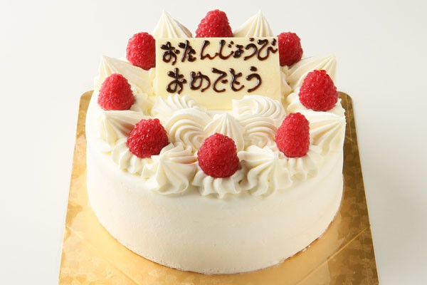

<!DOCTYPE html>
<html>
<head>
	<meta charset="UTF-8">
	<meta name="viewport" content="width=device-width, initial-scale=1.0">
	<title>生日快乐！</title>
	
</head>
<body>
	
	<h1>亲爱的乖宝😘：</h1>
	
今天是你的生日，我想对你说一声“生日快乐

	
❤️爱意东升西落，浪漫至死不渝。❤️

                
虽然你不过生日，但我还是记得你的生日哦，爱你

</body>
</html>
